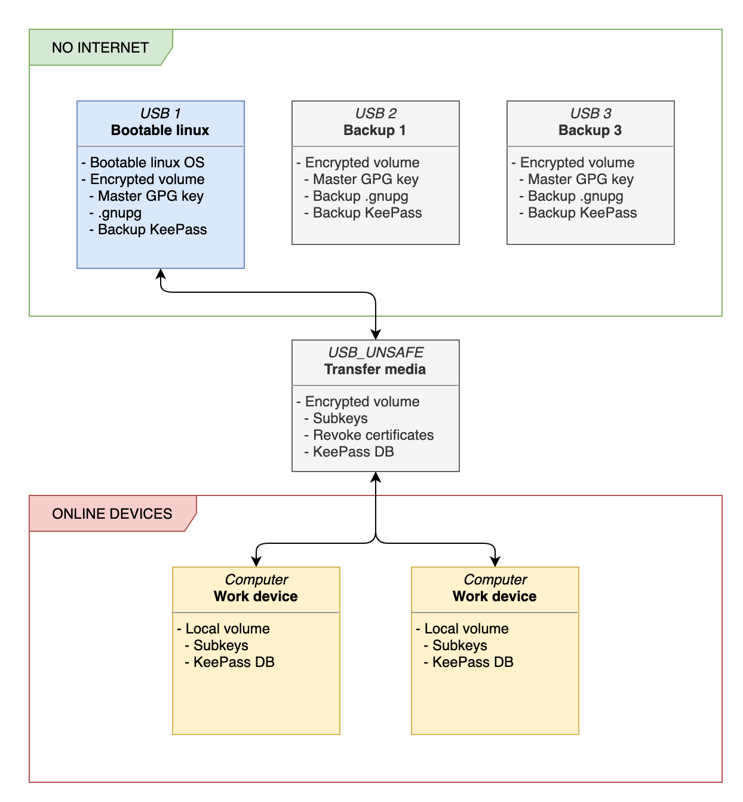

# Storage strategy

Storing GPG master keys in a secure offline environment is my start point for the storage strategy below.

The idea is to provide one offline environment, used only for the master key management and subkeys generation.
All data used in this environment are stored on encrypted media, the only system that interacts directly with this media is a live booted Linux like Tails.
Only subkeys are transferred to the online "unsafe" daily environment, over an encrypted media.

The GPG master key always stay on the offline environment, and the transfer media is never connected to the live booted Linux when a master key is present on the system.

## Abstract diagram

