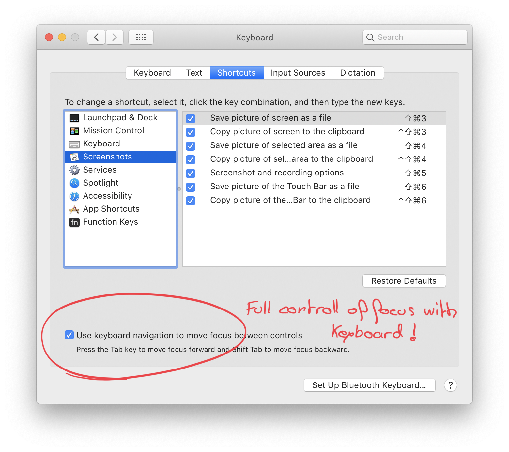

# macOS Tips

## Full keyboard control of focus

By default you cannont use the keyboard (with tab and space) everywere to move focus. Like in a modal.
To activat the capability to move focus with keyboard everywere, just activate the following in keyboard preferences :



## Use TouchId to authenticate when using sudo

Tell the system to call the touchId module when trying a privilege elevation with sudo.
Just add in the `/etc/pam.d/sudo` file the line `auth sufficient pam_tid.so` below the first line. This just tells that the touchId authentication is sufficient to authorize a sudo privilege elevation.

## Generate an `.icns` file from an `.iconset` folder

`.icns` are the format for macOS icons.

```
$ iconutil -c icns <iconset filename>
```